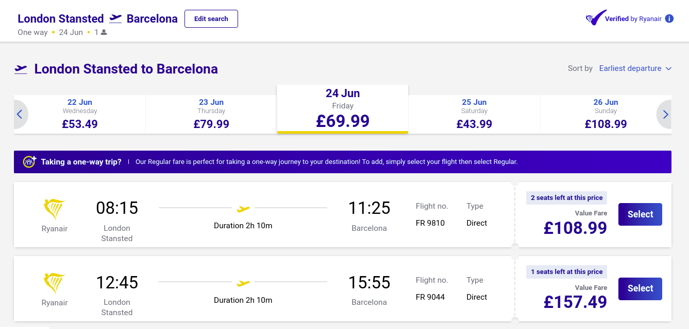

# FlightsPrice
HAVE YOU EVER WONDERED WHEN IS THE BEST TIME TO BUY A TICKET? <br/>
We've created a dataset of Ryanair flights and we've tried to predict the price based on the period of the year, the day of the week, and many other features. 
The best model allows to choose the best flight with a margin of error of 9 euros but could be easily improved with a larger dataset.
To use the built system we just have to choose the date of the flight, the departure airport, and the arrival one and it will predict the price behavior.

<p align='center'>
  
</p>

### Usage

Let's explain how to use the system:

* ```FlighPriceBLQ-BVA.ipynb```: Extract flights for the next N days from the date of tracking. You can arbitraly change the arrival and departure airport and the amount of days to track (if the number is too high you risk to loose some flights). 
* ```Merge&CleanDataset.ipynb```: Merge the .csv files to create a unique file and clean it. 
* ```AirFlightPrice.ipynb```: It's the core of the system. Here you preprocess data, train model and evaluate them.

